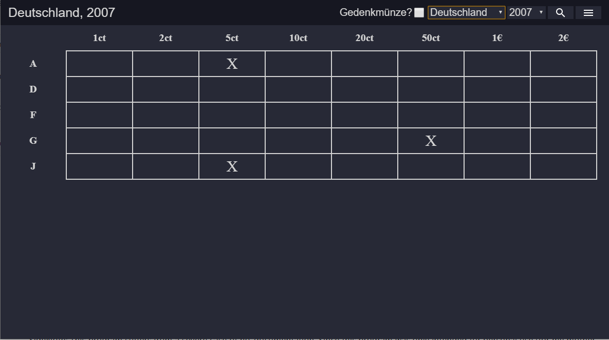
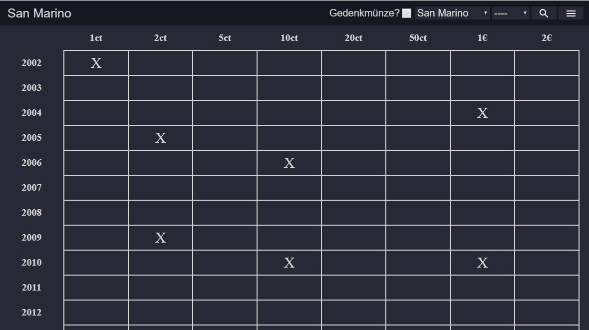

# CoinCollector
A small program to manage a collection of euro coins written with the electron framework.

It also contains a simple web-scrapper feature on button press, that will look for new special coinages and add a year if the next year is not already in the database.

Based on the simple nature of the web scrapper this feature may break sometime in the future if the used site changes too much.

A console is also implemented that allows fixing errors, adding years and countries by hand as well as printing a log file to look for errors in the database.

## Screenshots

SideNote: This program suffers from a severe case of no-documentation. Since this program was only intended for personal use (for my mother to be exact) I dont think I will work on it further, because its already in use and it does what its supposed to do :)
